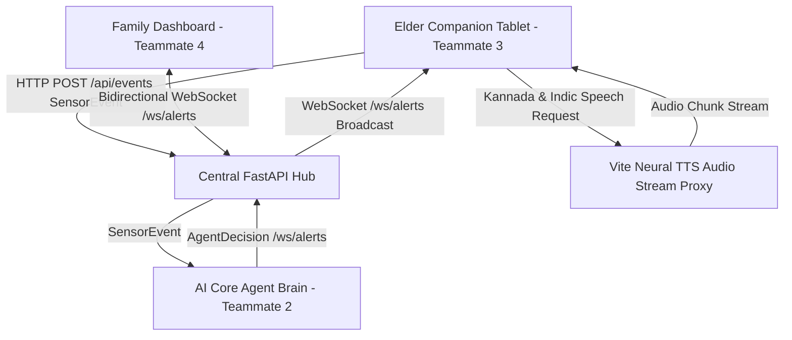

# SHASTRA SYNC — Elder Companion Tablet App (Teammate 3)

[](https://vitejs.dev/)
[](https://reactjs.org/)
[](https://web.dev/progressive-web-apps/)
[](https://github.com/SumedhSA3021/T3_Elderly_App)
[](LICENSE)

**Teammate 3 Module** — An elderly-first, voice-empowered tablet application crafted for seniors (**Kamala Devi**, 78). Designed with a soothing, soft **Aubergine aesthetic**, high-contrast accessible typography, and natural conversational cadence. 

The application provides ambient fall detection, a living conversational care companion, bidirectional synchronization with the **Family Dashboard (Teammate 4)**, and autonomous event dispatching to the **AI Core (Teammate 2)**.

---

## 🌟 Architecture & Data Flow



---

## 🚀 Key Features

### 1. Living AI Companion Sanctuary (Hero Card)
- **Ambient Voice Interaction:** Tap the central glowing microphone to talk directly to your care companion.
- **Real-Time Speech Streaming:** As you speak, recognized words stream onto the screen in bold real-time text before finalizing.
- **Adaptive Speech Segmentation:** Automatic silence detection with 6-second recording window and safety timeouts.
- **Direct Voice Playback:** Speaks all responses, inquiries, and check-ins generated by the **AI Core (Teammate 2 AgentDecision)** aloud with crystal clarity.
- **Voice Replay:** Includes a `🔊 Replay Voice` button allowing seniors to re-listen to any AI response anytime.

### 2. High-Fidelity Indic Neural Speech Engine
- **Authentic Kannada & Indic Accents:** Integrated high-fidelity Indic neural TTS proxy (`/api/tts?q=...&tl=kn`) ensuring native, human pronunciation and cadence for Kannada script (`\u0C80-\u0CFF`) and transliterated phrases (`namaskara`, `hegiddira`, `oota`, `sahaya`, `biddiddira`).
- **Natural Breathing Cadence:** Sentences are automatically split into natural speech chunks on punctuation (`.`, `!`, `?`, `,`) with 120ms pauses between phrases.
- **Multi-Language Support:** Seamlessly supports **Kannada (`kn-IN`)**, **Hindi (`hi-IN`)**, **Tamil (`ta-IN`)**, **Telugu (`te-IN`)**, and **English (`en-IN` / `en-US`)**.

### 3. Bidirectional Family Dashboard Sync (Teammate 4 Link)
- **Verbatim Message Delivery:** Displays incoming text messages (both quick predefined and custom typed notes) from Priya (Daughter) character-for-character with zero AI alteration.
- **Custom Status Composer:** An integrated status composer allows the senior to type or send custom status updates directly back to the Family Dashboard in real-time.
- **Direct Family Calling:** One-tap `📞 Call Priya` button instantly triggers a high-priority call banner on Priya's Family Dashboard.

### 4. Full-Screen Incoming & Active Call Intercom
- **Ringing Call Overlay:** Full-screen animated overlay with caller avatar, chime, and large accessible **📞 Answer & Talk** and **✕ Decline** buttons.
- **Zero Call Looping:** Incorporates strict `handledCallsRef` deduplication filter preventing duplicate or infinite call loops.
- **Active In-Progress Screen:** Transition to live in-call overlay with duration timer (`● LIVE CALL CONNECTED 00:15`) and a prominent **🔴 End Call** button.

### 5. Fall Detection & Emergency SOS Guardian
- **Context-Aware Emergency Inquiry:** Prompts the elder with empathetic, clear voice and text: *"Kamala, did you fall? Are you fine? Please confirm if you are okay."* / *"ನೀವು ಕೆಳಗೆ ಬಿದ್ದಿದ್ದೀರಾ? ಕ್ಷೇಮವಾಗಿದ್ದೀರಾ?"*
- **Vocal Cancellation:** Allows the elder to simply speak *"I am fine"* or *"I am okay"* to dismiss false-positive fall check-ins safely.
- **Emergency SOS Button:** One-tap high-urgency SOS alert broadcasted to the Hub, 112 emergency services, and the Family Dashboard.

### 6. Senior Health & Profile Drawer
- **Comprehensive Medical Summary:** Accessible slide-over drawer displaying vitals (Heart Rate, Blood Pressure, Blood Glucose, SpO2), prescribed medications, and medical history.
- **Caregiver & Doctor Contacts:** Direct emergency dial buttons for primary family caregiver (Priya) and consulting physician (Dr. Arvind Sharma).

### 7. Daily Wellness Rhythm & Medication FAB
- **Interactive Daily Check-Ins:** Scheduled morning sleep, midday meal, mobility checks, and evening cognitive assessments.
- **Floating Medication Reminder (FAB):** Track pending doses, mark medications as taken (`✓ Done`), or add quick medicine reminders on demand.

---

## 📡 System Integration & Schemas

The Elder App communicates with the shared FastAPI Hub and WebSocket stream using standardized contracts:

| Schema | Direction | Protocol | Purpose |
|---|---|---|---|
| **Schema A (`SensorEvent`)** | Elder $\rightarrow$ Hub | HTTP `POST /api/events` | Dispatches voice transcripts, SOS triggers, fall responses, and wellness check-ins. |
| **Schema B (`AgentDecision`)** | AI Core $\rightarrow$ Elder | WebSocket `/ws/alerts` | Receives autonomous agent decisions, voice inquiries, and synthesized speech responses. |
| **Schema C (`FamilyAlert`)** | Hub $\rightarrow$ Elder / Family | WebSocket `/ws/alerts` | Broadcasts emergency alerts, fall events, and family notifications. |
| **Schema D (`CallInvite`)** | Family $\rightarrow$ Elder | WebSocket `/ws/alerts` | Triggers the ringing incoming call screen on the elder tablet. |
| **Schema E (`CallResponse`)** | Elder $\rightarrow$ Family | WebSocket `/ws/alerts` | Reports call acceptance or decline back to the family dashboard. |

---

## ⚙️ Environment Configuration

Create a `.env` file from `.env.example`:

```env
# Base Backend REST API URL
VITE_API_URL=https://3.110.50.100.nip.io

# Central WebSocket Alert Stream
VITE_WS_URL=wss://3.110.50.100.nip.io/ws/alerts

# Elder Identity
VITE_ELDER_ID=kamala_001
```

> **Note:** The application includes resilient built-in fallbacks to `https://3.110.50.100.nip.io`, ensuring immediate connectivity even if environment variables are omitted.

---

## 🚀 Getting Started Locally

### Prerequisites
- Node.js 18+ (Node 20+ recommended)
- Google Chrome or Microsoft Edge (recommended for Web Speech API and HTML5 Audio)

### Installation
```bash
# Clone the repository
git clone https://github.com/SumedhSA3021/T3_Elderly_App.git

# Navigate into project directory
cd T3_Elderly_App

# Install dependencies
npm install

# Launch local development server (with HTTPS)
npm run dev
```

Open [https://localhost:5173/](https://localhost:5173/) in your browser.

### Production Build
```bash
npm run build
npm run preview
```

---

## 📁 Repository Structure

```
T3_Elderly_App/
├── public/
│   ├── favicon.svg                # Application icon
│   ├── manifest.json              # PWA manifest
│   └── sw.js                      # Offline service worker
├── src/
│   ├── api/
│   │   └── api.js                 # REST API client for SensorEvent (Schema A) & decisions
│   ├── components/
│   │   ├── ElderScreen.jsx        # Core Sanctuary UI: Voice, Family Link, Calling & SOS
│   │   ├── ElderScreen.css        # Aubergine design system, glassmorphism & soft buttons
│   │   ├── ElderProfileView.jsx   # Senior health profile drawer with vitals & contacts
│   │   ├── FallEmergencyModal.jsx # Critical fall detection confirmation modal
│   │   ├── CheckInCard.jsx        # Daily wellness check-in interactive card
│   │   ├── ConnectionBanner.jsx   # Live WebSocket connection telemetry banner
│   │   └── SplashScreen.jsx       # Welcoming initial launch splash screen
│   ├── config/
│   │   └── checkInConfig.js       # Health check-in schedules & question templates
│   ├── hooks/
│   │   ├── useVoiceHandler.js     # Dual-engine speech recognition (STT) & Indic neural TTS
│   │   ├── useWebSocket.js        # Resilient WebSocket client with auto-reconnect
│   │   └── useCheckInScheduler.js # Automated health check-in scheduler & triggers
│   ├── services/
│   │   └── ElderAiCompanionService.js # Empathetic local conversational companion engine
│   ├── utils/
│   │   ├── audioChimes.js         # Melodic chime synthesizers using Web Audio API
│   │   ├── offlineQueue.js        # IndexedDB offline event queue
│   │   └── translator.js          # Multi-lingual UI localization dictionary (EN, KN, HI, TA, TE)
│   ├── App.jsx                    # Root application component
│   ├── index.css                  # Global tokens, typography & animations
│   └── main.jsx                   # Application entry point
├── vercel.json                    # Vercel SPA routing & cache configuration
├── vite.config.js                 # Vite configuration with Indic TTS audio stream proxy
└── package.json                   # Project dependencies & metadata
```

---

## ☁️ Deployment on Vercel

The project includes a ready-to-deploy [`vercel.json`](./vercel.json) configured for Vite Single Page Application routing.

1. Go to [vercel.com](https://vercel.com/) and click **Add New Project**.
2. Import **`SumedhSA3021/T3_Elderly_App`**.
3. Under **Build and Output Settings**:
   - **Framework Preset:** `Vite`
   - **Build Command:** `npm run build`
   - **Output Directory:** `dist`
4. Under **Environment Variables**, add:
   - `VITE_API_URL` = `https://3.110.50.100.nip.io`
   - `VITE_WS_URL` = `wss://3.110.50.100.nip.io/ws/alerts`
   - `VITE_ELDER_ID` = `kamala_001`
5. Click **Deploy**. Vercel will provision an SSL certificate and assign an HTTPS URL automatically.

---

## 📄 License
This project is licensed under the MIT License — see the [LICENSE](LICENSE) file for details.
